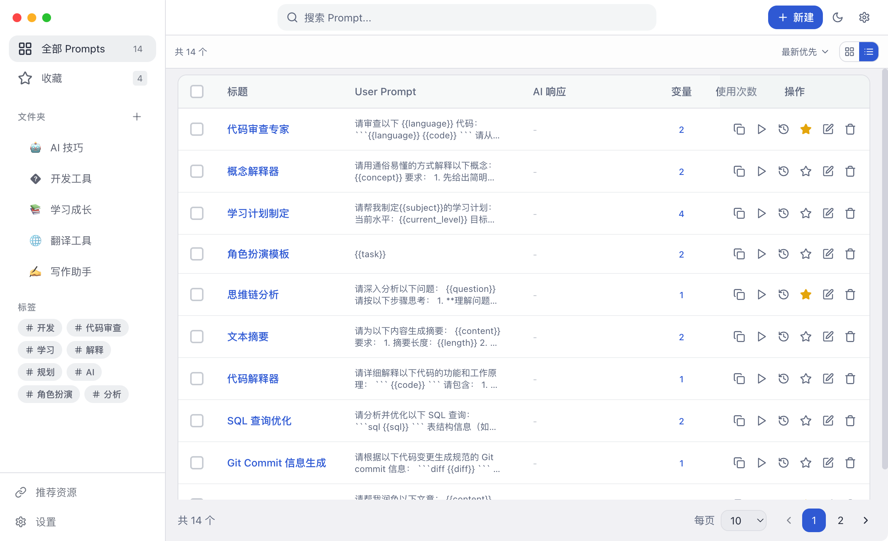

我大概来说一下我修改了哪些内容：

1. 添加隐私文件夹并设置密码
2. 添加图片预览
	  - 可以本地上传或者直接复制粘贴
	  - 可以窗口内预览图片
3. 添加图片模式列表模式
4. 修改【创建】【保存】的位置
5. 右键菜单支持：
     - 在卡片视图、列表视图和画廊视图中均已支持右键点击。
     - 右键菜单包含：查看详情、编辑、复制、收藏、AI 测试、版本历史、删除。
6. 画廊视图图片大小调整：
     - 在画廊视图下，顶部工具栏会出现 S / M / L 切换按钮。
     - 支持切换小图、中图、大图（自动调整网格列数）。
     - 设置会自动保存。

---
### 截图


---
<div align="center">
  
  <h1>PromptHub</h1>
  <p><strong>🚀 开源免费的 AI Prompt 管理工具，数据完全存储在本地</strong></p>
  <p>高效管理、版本控制、变量模板、多模型测试 — 一站式 Prompt 工作台</p>
  
  <p>
    <a href="https://github.com/legeling/PromptHub/stargazers"></a>
    <a href="https://github.com/legeling/PromptHub/network/members"></a>
    <a href="https://github.com/legeling/PromptHub/releases"></a>
    <a href="https://github.com/legeling/PromptHub/releases"></a>
    
  </p>
  
  <p>
    
    
    
    
  </p>
  
  <p>
    <a href="./README.md">简体中文</a> ·
    <a href="./docs/README.en.md">English</a>
  </p>
</div>

<br/>

> 💡 **为什么选择 PromptHub？**
> 
> 还在笔记本、文档和聊天记录里到处翻找 Prompt？PromptHub 让你像管理代码一样管理 Prompt — 支持版本控制、变量模板、多模型测试，所有数据都存在本地，隐私安全有保障。

---

## ✨ 功能特性

- **📝 Prompt 管理** - 创建、编辑、删除，支持文件夹和标签分类
- **⭐ 收藏系统** - 快速收藏常用 Prompt，一键访问
- **🔄 版本控制** - 自动保存历史版本，支持查看和回滚
- **🔧 变量系统** - 模板变量 `{{variable}}`，动态替换
- **📋 一键复制** - 快速复制 Prompt 到剪贴板
- **🔍 全文搜索** - 快速搜索标题、描述和内容
- **📤 数据导出** - JSON 格式备份和恢复
- **🎨 主题定制** - 深色/浅色/跟随系统，多种主题色可选
- **🌐 多语言** - 支持中文和英文界面
- **💾 本地存储** - 所有数据存储在本地，隐私安全有保障
- **🖥️ 跨平台** - 支持 macOS、Windows、Linux
- **📊 列表视图** - 表格式展示 Prompt，支持排序和批量操作
- **🤖 AI 测试** - 内置多模型测试，支持 18+ 服务商

## 📸 截图

<div align="center">
  <p><strong>主界面</strong></p>
  
  <br/><br/>
  <p><strong>主题设置</strong></p>
  
  <br/><br/>
  <p><strong>数据备份</strong></p>
  
  <br/><br/>
  <p><strong>AI 模型配置</strong></p>
  
  <br/><br/>
  <p><strong>版本对比</strong></p>
  
  <br/><br/>
  <p><strong>列表视图模式</strong></p>
  
</div>

## 📦 安装

### 下载安装包

从 [Releases](https://github.com/legeling/PromptHub/releases) 下载对应平台的安装包：

| 平台 | 下载 |
|------|------|
| macOS (Intel) | `PromptHub-x.x.x-x64.dmg` |
| macOS (Apple Silicon) | `PromptHub-x.x.x-arm64.dmg` |
| Windows | `PromptHub-Setup-x.x.x-x64.exe` |
| Linux | `PromptHub-x.x.x.AppImage` 或 `.deb` |

### macOS 首次启动

由于应用未经过 Apple 公证签名，首次打开时可能会提示 **"PromptHub 已损坏，无法打开"** 或 **"无法验证开发者"**。

**解决方法（推荐）**：打开终端，执行以下命令绕过公证检查：

```bash
sudo xattr -rd com.apple.quarantine /Applications/PromptHub.app
```

> 💡 **提示**：如果应用安装在其他位置，请将路径替换为实际安装路径。

**或者**：打开「系统设置」→「隐私与安全性」→ 向下滚动找到安全性部分 → 点击「仍要打开」。

<div align="center">
  
</div>

### 从源码构建

```bash
# 克隆仓库
git clone https://github.com/legeling/PromptHub.git
cd PromptHub

# 安装依赖
pnpm install

# 开发模式
pnpm dev

# 构建应用
pnpm build
```

## 🚀 快速开始

### 1. 创建 Prompt

点击「新建」按钮，填写：
- **标题** - Prompt 名称
- **描述** - 简短说明用途
- **System Prompt** - 设置 AI 角色（可选）
- **User Prompt** - 实际的提示词内容
- **标签** - 便于分类和搜索

### 2. 使用变量

在 Prompt 中使用 `{{变量名}}` 语法定义变量：

```
请将以下 {{source_lang}} 文本翻译成 {{target_lang}}：

{{text}}
```

### 3. 复制使用

选中 Prompt，点击「复制」，Prompt 内容将复制到剪贴板。

### 4. 版本管理

编辑 Prompt 时会自动保存历史版本，点击「历史版本」可以查看和恢复。

## 🛠️ 技术栈

| 类别 | 技术 |
|------|------|
| 框架 | Electron 33 |
| 前端 | React 18 + TypeScript 5 |
| 样式 | TailwindCSS |
| 状态管理 | Zustand |
| 本地存储 | IndexedDB + SQLite |
| 构建工具 | Vite + electron-builder |

## 📁 项目结构

```
PromptHub/
├── src/
│   ├── main/                # Electron 主进程
│   │   ├── database/        # SQLite 数据库操作
│   │   ├── ipc/             # IPC 通信处理
│   │   ├── index.ts         # 主进程入口
│   │   ├── menu.ts          # 应用菜单
│   │   ├── shortcuts.ts     # 快捷键
│   │   └── updater.ts       # 自动更新
│   ├── preload/             # 预加载脚本
│   ├── renderer/            # React 渲染进程
│   │   ├── components/      # UI 组件
│   │   │   ├── folder/      # 文件夹组件
│   │   │   ├── layout/      # 布局组件
│   │   │   ├── prompt/      # Prompt 组件
│   │   │   ├── settings/    # 设置页面
│   │   │   └── ui/          # 通用 UI 组件
│   │   ├── i18n/            # 国际化
│   │   ├── services/        # 服务层 (IndexedDB, AI, WebDAV)
│   │   ├── stores/          # Zustand 状态管理
│   │   └── styles/          # 全局样式
│   └── shared/              # 共享类型和常量
│       ├── constants/       # 常量定义
│       └── types/           # TypeScript 类型
├── resources/               # 应用图标等静态资源
├── .github/workflows/       # CI/CD 配置
└── package.json
```

## 📈 Star History

<a href="https://star-history.com/#legeling/PromptHub&Date">
  <picture>
    <source media="(prefers-color-scheme: dark)" srcset="https://api.star-history.com/svg?repos=legeling/PromptHub&type=Date&theme=dark" />
    <source media="(prefers-color-scheme: light)" srcset="https://api.star-history.com/svg?repos=legeling/PromptHub&type=Date" />
    
  </picture>
</a>

## 🗺️ 路线图

### v0.2.0 (当前)
- [x] Prompt CRUD 管理
- [x] 文件夹和标签系统
- [x] 收藏功能
- [x] 版本历史
- [x] 数据导入导出
- [x] 主题定制 (深色/浅色/跟随系统)
- [x] 多语言支持 (中/英)
- [x] WebDAV 同步功能
- [x] Windows 无边框窗口
- [x] 文件夹拖拽排序
- [x] AI 模型配置（18+ 服务商）
- [x] AI 连接测试 & 模型对比
- [x] 多模型配置管理（无限数量）
- [x] MAC 窗口拖动优化
- [x] 自定义下拉选择框样式
- [x] 全面国际化支持（主页、编辑器、弹窗）
- [x] 应用内自动更新
- [x] 变量填充界面（复制/AI测试时均支持）
- [x] 最小化到系统托盘
- [x] Linux 平台支持
- [x] 编辑器行号显示
- [x] 列表视图模式（表格式展示所有 Prompt）
- [x] AI 测试结果持久化（每个 Prompt 保留最后一次测试结果）
- [x] 排序功能（按时间、标题、使用次数排序）

### 未来规划
- [ ] Web 版本（Docker/Cloudflare 部署）
- [ ] Prompt 模板市场
- [ ] 浏览器插件

## 📝 更新日志

### v0.2.0 (2025-12-03)
**新功能**
- ✨ 列表视图模式：表格式展示所有 Prompt，支持横向滚动和分页
- ✨ 批量操作：支持多选后批量收藏、移动到文件夹、删除
- ✨ AI 测试结果持久化：每个 Prompt 保留最后一次测试结果
- ✨ 排序功能：支持按时间、标题、使用次数排序
- ✨ 视图切换：卡片视图/列表视图一键切换
- ✨ 详情弹窗显示 AI 响应

**优化**
- 🎨 全新列表视图 UI（圆角设计、美观的多选框、悬浮提示）
- 🎨 分离单模型/多模型测试的 loading 状态
- 🎨 AI 测试弹窗支持变量填充

### v0.1.9 (2025-12-01)
**新功能**
- ✨ AI 模型分类图标使用本地 SVG/PNG 资源，展示真实提供商 Logo
- ✨ Prompt 版本历史弹窗国际化 & 加宽展示，阅读体验更好

**优化**
- 🔧 修复 Linux 打包缺少 author.email 导致构建失败
- 🔧 完整支持 macOS / Windows 自动更新增量包（dmg/zip/exe + blockmap）
- 🔧 更新弹窗支持纯文本 Release Notes、错误信息自动换行
- 🔧 修复检查更新弹窗每次打开都会重新请求的问题

### v0.1.8 (2025-12-01)
**新功能**
- ✨ 最小化到系统托盘功能（Windows/macOS/Linux）
- ✨ 数据目录路径可点击打开
- ✨ 编辑器支持行号显示
- ✨ 新增 Linux 平台支持（AppImage/deb）
- ✨ AI 模型动态获取（从供应商 API 获取可用模型列表）
- ✨ 模型选择弹窗（支持搜索、分类、批量添加）
- ✨ 模型分类展示（GPT/Claude/Gemini/DeepSeek 等自动分类）
- ✨ 模型分类图标（每个类别显示对应的 SVG 图标）
- ✨ API URL 智能预览（自动补全 /v1/chat/completions）
- ✨ 已添加模型按供应商分组折叠显示

**优化**
- 🎨 变量输入框支持自动变高（多行文本输入更友好）
- 🎨 优化 macOS 托盘图标显示
- 🎨 AI 测试状态按 Prompt 独立管理（切换 Prompt 不影响测试）
- 🎨 测试结果持久化（切换 Prompt 后结果保留）
- 🔧 检查更新支持多次点击
- 🔧 修复通知功能图标路径问题

### v0.1.7 (2025-11-30)
**新功能**
- ✨ AI 测试支持变量填充（与复制功能一致的体验）
- ✨ 多模型对比支持变量填充

**优化**
- 🎨 深色模式主题色增强（提高饱和度和可见度）
- 🎨 优化开关按钮深色模式样式（添加边框和更好的对比度）
- 🎨 AI 测试按钮改用主题色
- 🎨 关于页面图标美化
- 🔧 移除语言设置的"立即刷新"按钮（语言切换已即时生效）

### v0.1.6 (2025-11-30)
**优化**
- 🔧 修复自动更新元数据文件缺失问题（CI 上传 latest-mac.yml）
- 🔧 优化 Release 说明格式

### v0.1.5 (2025-11-30)
**新功能**
- ✨ 变量填充界面（复制时自动检测变量，弹出填充界面）

**优化**
- 🎨 文件夹选择下拉框改用自定义样式组件
- 🎨 编辑/新建 Prompt 弹窗加宽
- 🔧 修复版本对比问题（当前版本加入版本列表）
- 🔧 生产环境禁止打开开发者工具

### v0.1.4 (2025-11-30)
**新功能**
- ✨ 多模型配置管理（支持添加无限数量的 AI 模型）
- ✨ 多模型对比改为选择模式（从已配置模型中选择）
- ✨ 自定义下拉选择框组件（优化原生样式）
- ✨ 全面国际化支持（主页、编辑器、弹窗等全部适配多语言）
- ✨ 应用内自动更新（检查、下载、安装一体化）

**优化**
- 🎨 Prompt 卡片压缩（移除时间和版本显示）
- 🎨 多模型对比按钮移至右侧
- 🎨 优化 README 文档和截图展示
- 🔧 修复 MAC 顶部区域无法拖动窗口问题（整个顶部栏可拖动）
- 🔧 修复语言设置显示不同步问题
- 🔧 修复切换 Prompt 时对比结果残留问题
- 🔧 移除 macOS zip 构建包，只保留 dmg

### v0.1.3 (2025-11-29)
**新功能**
- ✨ AI 模型配置（支持 18+ 国内外服务商）
- ✨ AI 连接测试功能（异步测试，显示响应时间）
- ✨ AI 模型对比测试（并行测试多个模型效果）
- ✨ 图像生成模型支持（DALL-E 3 等）
- ✨ 完整的多语言支持（设置页面全面国际化）
- ✨ Git 风格版本对比（行级差异、添加/删除统计）

**优化**
- 🎨 优化设置页面 UI
- 🔧 移除 Prompt 卡片拖拽（修复点击问题）

### v0.1.2 (2025-11-29)
**新功能**
- ✨ WebDAV 同步功能（上传/下载数据到远程服务器）
- ✨ 文件夹拖拽排序
- ✨ Prompt 拖拽到文件夹
- ✨ 新建 Prompt 时可选择文件夹
- ✨ 版本恢复确认提示

**优化**
- 🎨 修复深色模式下开关按钮不可见问题
- 🎨 设置开关添加操作反馈提示
- 🎨 优化语言切换体验（添加刷新按钮）
- 🔧 开机自启动功能实现

### v0.1.1 (2025-11-29)
**新功能**
- ✨ 文件夹创建/编辑/删除功能
- ✨ 标签筛选功能
- ✨ 检查更新功能
- ✨ Windows 自定义标题栏

**优化**
- 🎨 扁平化 UI 设计
- 🎨 移除卡片阴影和缩放效果
- 🔧 WebDAV 同步配置界面

### v0.1.0 (2025-11-29)
- 🎉 首次发布
- ✨ Prompt CRUD 管理
- ✨ 文件夹和标签系统
- ✨ 收藏功能
- ✨ 版本历史
- ✨ 数据导入导出
- ✨ 主题定制
- ✨ 多语言支持

## 🤝 贡献

欢迎贡献代码！请遵循以下步骤：

1. Fork 本仓库
2. 创建特性分支 (`git checkout -b feature/amazing-feature`)
3. 提交更改 (`git commit -m 'Add amazing feature'`)
4. 推送到分支 (`git push origin feature/amazing-feature`)
5. 创建 Pull Request

## 📄 许可证

本项目采用 [AGPL-3.0 License](./LICENSE) 开源协议。

## 💬 支持

- **问题反馈**: [GitHub Issues](https://github.com/legeling/PromptHub/issues)
- **功能建议**: [GitHub Discussions](https://github.com/legeling/PromptHub/discussions)

## 🙏 致谢

- [Electron](https://www.electronjs.org/) - 跨平台桌面应用框架
- [React](https://react.dev/) - UI 框架
- [TailwindCSS](https://tailwindcss.com/) - CSS 框架
- [Zustand](https://zustand-demo.pmnd.rs/) - 状态管理
- [Lucide](https://lucide.dev/) - 图标库

---

<div align="center">
  <p><strong>如果这个项目对你有帮助，请给个 ⭐ 支持一下！</strong></p>
  
  <a href="https://www.buymeacoffee.com/legeling" target="_blank">
    
  </a>
  
  <p>Made with ❤️ by <a href="https://github.com/legeling">legeling</a></p>
</div>
