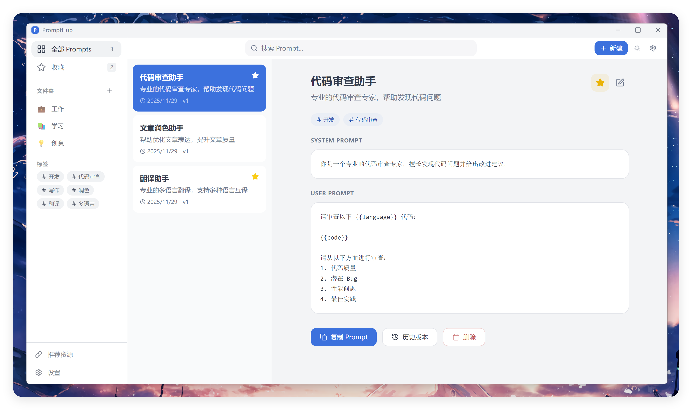

<div align="center">
  <h1>PromptHub · AI Prompt 管理器</h1>
  <p>一款开源、本地优先的 AI Prompt 管理工具，帮助你高效管理、版本控制和复用 Prompt。</p>
  <p>
    <a href="https://github.com/legeling/PromptHub/stargazers"></a>
    <a href="https://github.com/legeling/PromptHub/network/members"></a>
    
    
    
    
  </p>
</div>

<p align="center">
  <a href="./README.md">简体中文</a> ·
  <a href="./docs/README.en.md">English</a>
</p>

---

## ✨ 功能特性

- **📝 Prompt 管理** - 创建、编辑、删除，支持文件夹和标签分类
- **⭐ 收藏系统** - 快速收藏常用 Prompt，一键访问
- **🔄 版本控制** - 自动保存历史版本，支持查看和回滚
- **🔧 变量系统** - 模板变量 `{{variable}}`，动态替换
- **📋 一键复制** - 快速复制 Prompt 到剪贴板
- **🔍 全文搜索** - 快速搜索标题、描述和内容
- **📤 数据导出** - JSON 格式备份和恢复
- **🎨 主题定制** - 深色/浅色/跟随系统，多种主题色可选
- **🌐 多语言** - 支持中文和英文界面
- **💾 本地存储** - 数据完全存储在本地，隐私安全

## 📸 截图

<div align="center">
  <p><strong>macOS</strong></p>
  
  <br/><br/>
  <p><strong>Windows</strong></p>
  
</div>

## 📦 安装

### 下载安装包

从 [Releases](https://github.com/legeling/PromptHub/releases) 下载对应平台的安装包：

| 平台 | 下载 |
|------|------|
| macOS | `PromptHub-x.x.x.dmg` |
| Windows | `PromptHub-x.x.x-setup.exe` |

### 从源码构建

```bash
# 克隆仓库
git clone https://github.com/legeling/PromptHub.git
cd PromptHub

# 安装依赖
pnpm install

# 开发模式
pnpm dev

# 构建应用
pnpm build
```

## 🚀 快速开始

### 1. 创建 Prompt

点击「新建」按钮，填写：
- **标题** - Prompt 名称
- **描述** - 简短说明用途
- **System Prompt** - 设置 AI 角色（可选）
- **User Prompt** - 实际的提示词内容
- **标签** - 便于分类和搜索

### 2. 使用变量

在 Prompt 中使用 `{{变量名}}` 语法定义变量：

```
请将以下 {{source_lang}} 文本翻译成 {{target_lang}}：

{{text}}
```

### 3. 复制使用

选中 Prompt，点击「复制」，Prompt 内容将复制到剪贴板。

### 4. 版本管理

编辑 Prompt 时会自动保存历史版本，点击「历史版本」可以查看和恢复。

## 🛠️ 技术栈

| 类别 | 技术 |
|------|------|
| 框架 | Electron 28 |
| 前端 | React 18 + TypeScript 5 |
| 样式 | TailwindCSS |
| 状态管理 | Zustand |
| 本地存储 | IndexedDB |
| 构建工具 | Vite + electron-builder |

## 📁 项目结构

```
PromptHub/
├── src/
│   ├── main/           # Electron 主进程
│   ├── preload/        # 预加载脚本
│   ├── renderer/       # React 渲染进程
│   │   ├── components/ # UI 组件
│   │   ├── stores/     # Zustand 状态管理
│   │   ├── services/   # 数据库服务
│   │   └── styles/     # 全局样式
│   └── shared/         # 共享类型
├── resources/          # 静态资源
└── package.json
```

## 📈 Star History

<a href="https://star-history.com/#legeling/PromptHub&Date">
  <picture>
    <source media="(prefers-color-scheme: dark)" srcset="https://api.star-history.com/svg?repos=legeling/PromptHub&type=Date&theme=dark" />
    <source media="(prefers-color-scheme: light)" srcset="https://api.star-history.com/svg?repos=legeling/PromptHub&type=Date" />
    
  </picture>
</a>

## 🗺️ 路线图

### v0.1.3 (当前)
- [x] Prompt CRUD 管理
- [x] 文件夹和标签系统
- [x] 收藏功能
- [x] 版本历史
- [x] 数据导入导出
- [x] 主题定制 (深色/浅色/跟随系统)
- [x] 多语言支持 (中/英)
- [x] WebDAV 同步功能
- [x] Windows 无边框窗口
- [x] 文件夹拖拽排序
- [x] AI 模型配置（18+ 服务商）
- [x] AI 连接测试 & 模型对比

### 未来规划
- [ ] 变量填充界面
- [ ] Prompt 模板市场
- [ ] 浏览器插件
- [ ] 自动更新功能

## 📝 更新日志

### v0.1.3 (2025-11-29)
**新功能**
- ✨ AI 模型配置（支持 18+ 国内外服务商）
- ✨ AI 连接测试功能（异步测试，显示响应时间）
- ✨ AI 模型对比测试（并行测试多个模型效果）
- ✨ 图像生成模型支持（DALL-E 3 等）
- ✨ 完整的多语言支持（设置页面全面国际化）
- ✨ Git 风格版本对比（行级差异、添加/删除统计）

**优化**
- 🎨 优化设置页面 UI
- 🔧 移除 Prompt 卡片拖拽（修复点击问题）

### v0.1.2 (2025-11-29)
**新功能**
- ✨ WebDAV 同步功能（上传/下载数据到远程服务器）
- ✨ 文件夹拖拽排序
- ✨ Prompt 拖拽到文件夹
- ✨ 新建 Prompt 时可选择文件夹
- ✨ 版本恢复确认提示

**优化**
- 🎨 修复深色模式下开关按钮不可见问题
- 🎨 设置开关添加操作反馈提示
- 🎨 优化语言切换体验（添加刷新按钮）
- 🔧 开机自启动功能实现

### v0.1.1 (2025-11-29)
**新功能**
- ✨ 文件夹创建/编辑/删除功能
- ✨ 标签筛选功能
- ✨ 检查更新功能
- ✨ Windows 自定义标题栏

**优化**
- 🎨 扁平化 UI 设计
- 🎨 移除卡片阴影和缩放效果
- 🔧 WebDAV 同步配置界面

### v0.1.0 (2025-11-29)
- 🎉 首次发布
- ✨ Prompt CRUD 管理
- ✨ 文件夹和标签系统
- ✨ 收藏功能
- ✨ 版本历史
- ✨ 数据导入导出
- ✨ 主题定制
- ✨ 多语言支持

## 🤝 贡献

欢迎贡献代码！请遵循以下步骤：

1. Fork 本仓库
2. 创建特性分支 (`git checkout -b feature/amazing-feature`)
3. 提交更改 (`git commit -m 'Add amazing feature'`)
4. 推送到分支 (`git push origin feature/amazing-feature`)
5. 创建 Pull Request

## 📄 许可证

本项目采用 [MIT License](./LICENSE) 开源协议。

## 💬 支持

- **问题反馈**: [GitHub Issues](https://github.com/legeling/PromptHub/issues)
- **功能建议**: [GitHub Discussions](https://github.com/legeling/PromptHub/discussions)

## 🙏 致谢

- [Electron](https://www.electronjs.org/) - 跨平台桌面应用框架
- [React](https://react.dev/) - UI 框架
- [TailwindCSS](https://tailwindcss.com/) - CSS 框架
- [Zustand](https://zustand-demo.pmnd.rs/) - 状态管理
- [Lucide](https://lucide.dev/) - 图标库

---

<div align="center">
  <p><strong>如果这个项目对你有帮助，请给个 ⭐ 支持一下！</strong></p>
  <p>Made with ❤️ by <a href="https://github.com/legeling">legeling</a></p>
</div>
