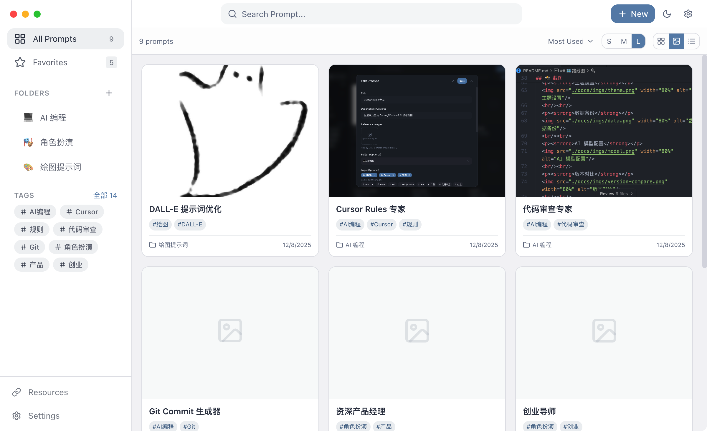

<div align="center">
  
  <h1>PromptHub</h1>
  <p><strong>🚀 Open-Source, Local-First AI Prompt Manager</strong></p>
  <p>Efficient management, version control, variable filling, multi-model testing — All-in-one Prompt workflow</p>
  
  <p>
    <a href="https://github.com/legeling/PromptHub/stargazers"></a>
    <a href="https://github.com/legeling/PromptHub/network/members"></a>
    <a href="https://github.com/legeling/PromptHub/releases"></a>
    <a href="https://github.com/legeling/PromptHub/releases"></a>
    
  </p>
  
  <p>
    
    
    
    
  </p>
  
  <p>
    <a href="../README.md">简体中文</a> ·
    <a href="./README.en.md">English</a>
  </p>
</div>

<br/>

> 💡 **Why PromptHub?**
> 
> Tired of searching for prompts in notebooks, documents, and chat histories? PromptHub lets you manage prompts like code — version control, variable templates, multi-model testing, all local and privacy-first.

---

## ✨ Features

- **📝 Prompt Management** - Create, edit, delete with folder and tag organization
- **⭐ Favorites** - Quick access to frequently used prompts
- **🔄 Version Control** - Auto-save history with view and rollback support
- **🔧 Variable System** - Template variables `{{variable}}` with dynamic replacement
- **📋 One-Click Copy** - Quickly copy prompts to clipboard
- **🔍 Full-Text Search** - Fast search across titles, descriptions, and content
- **📤 Data Export** - JSON format backup and restore
- **🎨 Theme Customization** - Dark/Light/System modes with multiple accent colors
- **🌐 Multi-Language** - Chinese and English interface support
- **💾 Local Storage** - All data stored locally for privacy
- **🖥️ Cross-Platform** - Support for macOS, Windows, Linux
- **📊 List View** - Table-style display with sorting and batch operations
- **🤖 AI Testing** - Built-in multi-model testing with 18+ providers
- **🧭 Markdown Preview** - Safe Markdown rendering with syntax highlight everywhere (Detail, List, Edit)
- **🪟 Wide & Full Modes** - Optimized editing experience with wider and fullscreen modes
- **🔐 Master Password & Private Folders** - Secure private content with a master password (data encryption WIP)
- **🖼️ Image Upload & Preview** - Upload/paste local images and preview them in modals

## 📸 Screenshots

<div align="center">
  <p><strong>Main Interface</strong></p>
  
  <br/><br/>
  <p><strong>Theme Settings</strong></p>
  
  <br/><br/>
  <p><strong>Data Backup</strong></p>
  
  <br/><br/>
  <p><strong>AI Model Configuration</strong></p>
  
  <br/><br/>
  <p><strong>Version Comparison</strong></p>
  
  <br/><br/>
  <p><strong>List View Mode</strong></p>
  
  <p><strong>Gallery Mode</strong></p>
  
</div>

## 📦 Installation

### Download

Download the installer for your platform from [Releases](https://github.com/legeling/PromptHub/releases):

| Platform | Download |
|----------|----------|
| macOS (Intel) | `PromptHub-x.x.x-x64.dmg` |
| macOS (Apple Silicon) | `PromptHub-x.x.x-arm64.dmg` |
| Windows | `PromptHub-x.x.x-Setup-x64.exe` |
| Linux | `PromptHub-x.x.x.AppImage` / `.deb` |

### macOS First Launch

Since the app is not notarized by Apple, you may see **"PromptHub is damaged and can't be opened"** or **"Cannot verify developer"** on first launch.

**Solution (Recommended)**: Open Terminal and run the following command to bypass Gatekeeper:

```bash
sudo xattr -rd com.apple.quarantine /Applications/PromptHub.app
```

> 💡 **Tip**: If the app is installed elsewhere, replace the path with the actual installation path.

**Or**: Open "System Settings" → "Privacy & Security" → scroll down to Security section → click "Open Anyway".

<div align="center">
  
</div>

### Build from Source

```bash
# Clone repository
git clone https://github.com/legeling/PromptHub.git
cd PromptHub

# Install dependencies
pnpm install

# Development mode
pnpm dev

# Build application
pnpm build
```

## 🚀 Quick Start

### 1. Create a Prompt

Click the "New" button and fill in:
- **Title** - Prompt name
- **Description** - Brief usage description
- **System Prompt** - Set AI role (optional)
- **User Prompt** - The actual prompt content
- **Tags** - For categorization and search

### 2. Use Variables

Use `{{variable_name}}` syntax in your prompts:

```
Please translate the following {{source_lang}} text to {{target_lang}}:

{{text}}
```

### 3. Copy and Use

Select a prompt and click "Copy" to copy the content to clipboard.

### 4. Version Management

Edit history is automatically saved. Click "History" to view and restore previous versions.

## 🛠️ Tech Stack

| Category | Technology |
|----------|------------|
| Framework | Electron 33 |
| Frontend | React 18 + TypeScript 5 |
| Styling | TailwindCSS |
| State Management | Zustand |
| Local Storage | IndexedDB |
| Build Tools | Vite + electron-builder |

## 📁 Project Structure

```
PromptHub/
├── src/
│   ├── main/           # Electron main process
│   ├── preload/        # Preload scripts
│   ├── renderer/       # React renderer process
│   │   ├── components/ # UI components
│   │   ├── stores/     # Zustand state management
│   │   ├── services/   # Database services
│   │   └── styles/     # Global styles
│   └── shared/         # Shared types
├── resources/          # Static assets
└── package.json
```

## 📈 Star History

<a href="https://star-history.com/#legeling/PromptHub&Date">
  <picture>
    <source media="(prefers-color-scheme: dark)" srcset="https://api.star-history.com/svg?repos=legeling/PromptHub&type=Date&theme=dark" />
    <source media="(prefers-color-scheme: light)" srcset="https://api.star-history.com/svg?repos=legeling/PromptHub&type=Date" />
    
  </picture>
</a>

## 🗺️ Roadmap

### v0.2.2 (Current)
- [x] Prompt CRUD management
- [x] Folder and tag system
- [x] Favorites feature
- [x] Version history
- [x] Data import/export
- [x] Theme customization (Dark/Light/System)
- [x] Multi-language support (Chinese/English)
- [x] WebDAV sync
- [x] Windows frameless window
- [x] Folder drag & drop sorting
- [x] AI model configuration (18+ providers)
- [x] AI connection test & model comparison
- [x] Multi-model configuration (unlimited)
- [x] Full i18n support (homepage, editor, modals)
- [x] In-app auto update
- [x] Variable fill-in interface (copy & AI test)
- [x] Minimize to system tray
- [x] Linux platform support
- [x] Editor line numbers
- [x] List view mode
- [x] AI test result persistence
- [x] Sorting functionality
- [x] Markdown Preview Everywhere
- [x] Master Password & Private Folders (Basic)
- [x] Qwen/Tongyi Model Compatibility
- [x] Image Upload & Preview (upload/paste + modal preview)

### Future Plans
- [ ] Data encryption for private folders (AES-256)
- [ ] Web version (Docker/Cloudflare deployment)
- [ ] Prompt template marketplace
- [ ] Browser extension

## 📝 Changelog

### v0.2.3 (2025-12-08)
**Bug Fixes**
- 🐛 Fixed Windows input fields becoming unresponsive after deleting a Prompt (native confirm dialog focus issue)
- 🐛 Fixed Windows tray icon appearing transparent
- 🐛 Fixed About page icon not showing in packaged app
- 🐛 Fixed auto-updater module failing to load (switched to static import)

**Improvements**
- 🎨 Replaced native confirm dialog with custom ConfirmDialog for better Windows compatibility
- 🎨 Improved tray icon loading logic with fallback paths

### v0.2.2 (2025-12-08)
**Bug Fixes**
- 🐛 Fixed hardcoded version number in About page (now fetched dynamically)
- 🐛 Fixed About page icon not displaying correctly
- 🐛 Fixed update check failing (`cannot set properties of undefined`)
- 🐛 Fixed error handling when auto-updater module fails to load

**Improvements**
- 🎨 Show manual download link when auto-update fails
- 🔒 Clear data now requires master password verification (high-risk operation protection)

### v0.2.1 (2025-12-07)
**New Features**
- ✨ Markdown Preview: Safe Markdown rendering in List view, Detail modal, and Edit modal (unknown languages ignored).
- ✨ Master Password & Security: App-level master password setup with lock/unlock states.
- ✨ Private Folders (Beta): Mark folders as private, requiring unlock to access (encryption WIP).
- ✨ Enhanced Editing: Edit/Preview toggle, optimized input height, and Fullscreen/Wide modes.
- ✨ Sorted Tags: Tags are automatically sorted for better consistency.
- ✨ Image Upload & Preview: Upload/paste local images and preview them within modals.

**Improvements**
- 🔧 Qwen Compatibility: Fixed `enable_thinking` error for non-streaming calls.
- 🔧 UI Polish: Fixed fullscreen edit modal overlapping header buttons.
- 🔧 Performance: Optimized Markdown rendering and dependencies.

### v0.2.0 (2025-12-03)
**New Features**
- ✨ List view mode: table-style display of all prompts with horizontal scrolling and pagination
- ✨ Batch operations: multi-select with batch favorite, move to folder, delete
- ✨ AI test result persistence: save last test result for each prompt
- ✨ Sorting functionality: sort by time, title, usage count
- ✨ View switching: toggle between card view and list view
- ✨ Detail modal shows AI response

**Improvements**
- 🎨 New list view UI (rounded design, beautiful checkboxes, hover tooltips)
- 🎨 Separated loading states for single/multi-model testing
- 🎨 AI test modal supports variable filling

### v0.1.9 (2025-12-01)
**New Features**
- ✨ Local SVG/PNG assets for AI model icons
- ✨ Wider and internationalized Version History modal

**Improvements**
- 🔧 Fixed Linux build failure (author.email)
- 🔧 Full macOS/Windows delta update support
- 🔧 Release Notes in update dialog support plain text wrapping
- 🔧 Fixed redundant requests in update checker

### v0.1.8 (2025-12-01)
**New Features**
- ✨ Minimize to system tray
- ✨ Clickable data directory path
- ✨ Editor line numbers
- ✨ Linux platform support (AppImage/deb)
- ✨ Dynamic AI model fetching
- ✨ Model selection modal with search and categories
- ✨ Auto-categorized model display with icons
- ✨ Smart API URL preview
- ✨ Grouped model display

**Improvements**
- 🎨 Auto-expanding variable inputs
- 🎨 Optimized macOS tray icon
- 🎨 Independent AI test states per prompt
- 🎨 Persistent test results
- 🔧 Multiple clicks support for update check
- 🔧 Fixed notification icon path

### v0.1.7 (2025-11-30)
**New Features**
- ✨ Variable filling in AI test
- ✨ Variable filling in multi-model comparison

**Improvements**
- 🎨 Enhanced dark mode accent colors
- 🎨 Improved toggle switch style
- 🎨 Themed AI test button
- 🎨 Polished About page icons
- 🔧 Removed "Refresh" button from language settings

### v0.1.6 (2025-11-30)
**Improvements**
- 🔧 Fixed missing auto-update metadata (CI upload)
- 🔧 Optimized Release Notes format

### v0.1.5 (2025-11-30)
**New Features**
- ✨ Variable filling interface on copy

**Improvements**
- 🎨 Custom folder selection dropdown
- 🎨 Wider Edit/New Prompt modal
- 🔧 Fixed current version display in comparison
- 🔧 Disabled dev tools in production

### v0.1.4 (2025-11-30)
**New Features**
- ✨ Multi-model configuration management
- ✨ Selection-based model comparison
- ✨ Custom Select component
- ✨ Full internationalization
- ✨ In-app auto update

**Improvements**
- 🎨 Compact Prompt cards
- 🎨 Relocated comparison button
- 🎨 Optimized README and screenshots
- 🔧 Fixed macOS window dragging issue
- 🔧 Fixed language setting sync
- 🔧 Fixed comparison result persistence issue
- 🔧 Removed macOS zip build artifact

### v0.1.3 (2025-11-29)
**New Features**
- ✨ AI model configuration (18+ providers)
- ✨ AI connection test
- ✨ AI model comparison
- ✨ Image generation support
- ✨ Settings page i18n
- ✨ Git-style version comparison

**Improvements**
- 🎨 Optimized Settings UI
- 🔧 Removed card dragging (fixed click issues)

### v0.1.2 (2025-11-29)
**New Features**
- ✨ WebDAV sync
- ✨ Folder drag & drop sorting
- ✨ Prompt drag & drop to folder
- ✨ Folder selection in New Prompt
- ✨ Restore version confirmation

**Improvements**
- 🎨 Fixed dark mode toggle visibility
- 🎨 Added feedback for settings toggles
- 🎨 Improved language switching
- 🔧 Implemented launch at startup

### v0.1.1 (2025-11-29)
**New Features**
- ✨ Folder CRUD
- ✨ Tag filtering
- ✨ Check for updates
- ✨ Windows custom title bar

**Improvements**
- 🎨 Flat UI design
- 🎨 Removed card shadows and scaling
- 🔧 WebDAV config interface

### v0.1.0 (2025-11-29)
- 🎉 First release
- ✨ Prompt CRUD
- ✨ Folders & Tags
- ✨ Favorites
- ✨ Version History
- ✨ Import/Export
- ✨ Themes
- ✨ Multi-language support

## 🤝 Contribution

Contributions are welcome! Please follow these steps:

1. Fork the repository
2. Create a feature branch (`git checkout -b feature/amazing-feature`)
3. Commit your changes (`git commit -m 'Add amazing feature'`)
4. Push to the branch (`git push origin feature/amazing-feature`)
5. Open a Pull Request

## 📄 License

This project is licensed under the [AGPL-3.0 License](./LICENSE).

## 💬 Support

- **Issues**: [GitHub Issues](https://github.com/legeling/PromptHub/issues)
- **Discussions**: [GitHub Discussions](https://github.com/legeling/PromptHub/discussions)

## 🙏 Acknowledgements

- [Electron](https://www.electronjs.org/)
- [React](https://react.dev/)
- [TailwindCSS](https://tailwindcss.com/)
- [Zustand](https://zustand-demo.pmnd.rs/)
- [Lucide](https://lucide.dev/)
- All the amazing [contributors](https://github.com/legeling/PromptHub/graphs/contributors) who helped improve PromptHub!

---

<div align="center">
  <p><strong>If this project helps you, please give it a ⭐!</strong></p>
  
  <a href="https://www.buymeacoffee.com/legeling" target="_blank">
    
  </a>
  
  <p>Made with ❤️ by <a href="https://github.com/legeling">legeling</a></p>
</div>
