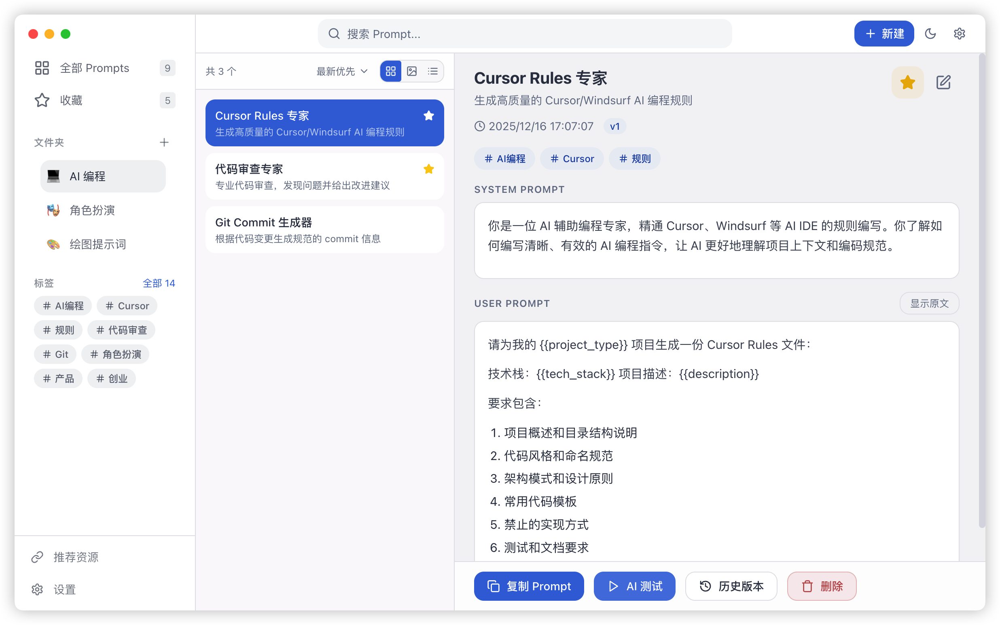
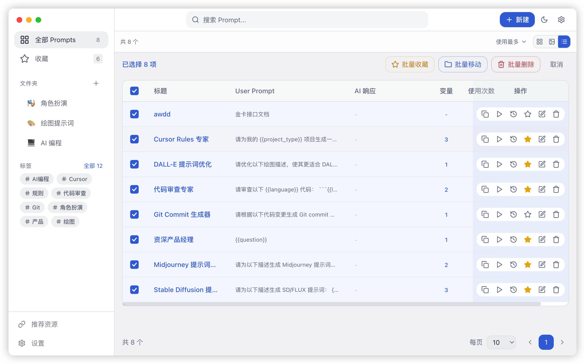

<div align="center">
  
  <h1>PromptHub</h1>
  <p><strong>🚀 Gestor de Prompts de IA Open‑Source, Local‑First</strong></p>
  <p>Gestión eficiente, control de versiones, plantillas de variables, pruebas multi‑modelo — Flujo de trabajo todo‑en‑uno</p>
  
  <p>
    <a href="https://github.com/legeling/PromptHub/stargazers"></a>
    <a href="https://github.com/legeling/PromptHub/network/members"></a>
    <a href="https://github.com/legeling/PromptHub/releases"></a>
    <a href="https://github.com/legeling/PromptHub/releases"></a>
    
  </p>
  
  <p>
    
    
    
    
  </p>
  
  <p>
    <a href="../README.md">简体中文</a> ·
    <a href="./README.zh-TW.md">繁體中文</a> ·
    <a href="./README.en.md">English</a> ·
    <a href="./README.ja.md">日本語</a> ·
    <a href="./README.de.md">Deutsch</a> ·
    <a href="./README.es.md">Español</a> ·
    <a href="./README.fr.md">Français</a>
  </p>
</div>

<br/>

> 💡 **¿Por qué PromptHub?**
> 
> ¿Cansado de buscar prompts en cuadernos, documentos e historiales de chat? PromptHub te permite gestionar prompts como código — control de versiones, plantillas de variables, pruebas multi-modelo, todo local y con privacidad primero.

---

## 📥 Descargar

> 💡 Haz clic en los enlaces a continuación para descargar la última versión, o visita la [página de Releases](https://github.com/legeling/PromptHub/releases) para todas las versiones.

| Plataforma | Arquitectura | Descargar |
|:---:|:---:|:---:|
| **Windows** | x64 | [PromptHub-Setup-0.2.6-x64.exe](https://github.com/legeling/PromptHub/releases/download/v0.2.6/PromptHub-Setup-0.2.6-x64.exe) |
| **macOS** | Apple Silicon (M1/M2/M3) | [PromptHub-0.2.6-arm64.dmg](https://github.com/legeling/PromptHub/releases/download/v0.2.6/PromptHub-0.2.6-arm64.dmg) |
| **macOS** | Intel | [PromptHub-0.2.6-x64.dmg](https://github.com/legeling/PromptHub/releases/download/v0.2.6/PromptHub-0.2.6-x64.dmg) |
| **Linux** | x64 (AppImage) | [PromptHub-0.2.6-x64.AppImage](https://github.com/legeling/PromptHub/releases/download/v0.2.6/PromptHub-0.2.6-x64.AppImage) |
| **Linux** | x64 (deb) | [PromptHub-0.2.6-amd64.deb](https://github.com/legeling/PromptHub/releases/download/v0.2.6/PromptHub-0.2.6-amd64.deb) |

---

## ✨ Características

- **📝 Gestión de Prompts** - Crear, editar, eliminar con organización por carpetas y etiquetas
- **⭐ Favoritos** - Acceso rápido a prompts de uso frecuente
- **🔄 Control de Versiones** - Guardado automático del historial con soporte para ver y revertir
- **🔧 Sistema de Variables** - Variables de plantilla `{{variable}}` con reemplazo dinámico
- **📋 Copiar con Un Clic** - Copiar prompts al portapapeles rápidamente
- **🔍 Búsqueda de Texto Completo** - Búsqueda rápida en títulos, descripciones y contenido
- **📤 Exportación/Importación** - Backup y restauración JSON (incluye imágenes y configuración de IA)
- **🎨 Personalización de Temas** - Modos Oscuro/Claro/Sistema con múltiples colores de acento
- **🌐 Multi-Idioma** - Soporte para chino simplificado, chino tradicional, inglés, japonés, español, alemán, francés
- **💾 Almacenamiento Local** - Todos los datos almacenados localmente para privacidad
- **🖥️ Multiplataforma** - Soporte para macOS, Windows, Linux
- **📊 Vista de lista** - Tabla con ordenación y operaciones por lote
- **🤖 Pruebas de IA** - Pruebas multi‑modelo integradas (18+ proveedores)
- **🎨 Modelos de imagen** - Configurar y probar generación de imágenes (p. ej. DALL‑E)
- **🧭 Vista previa Markdown** - Render seguro + resaltado de código
- **🪟 Modo ancho y pantalla completa** - Mejor experiencia de edición/lectura
- **🔐 Contraseña maestra y carpetas privadas** - Protección de contenido privado (cifrado WIP)
- **🖼️ Imágenes** - Subir/pegar imágenes locales y previsualizar en modal
- **☁️ Sincronización WebDAV** - Sincronización en la nube (inicio / intervalos)

## 📸 Capturas de Pantalla

<div align="center">
  <p><strong>Interfaz Principal</strong></p>
  
  <br/><br/>
  <p><strong>Vista de Galería</strong></p>
  
  <br/><br/>
  <p><strong>Vista de Lista</strong></p>
  
  <br/><br/>
  <p><strong>Backup de Datos</strong></p>
  
  <br/><br/>
  <p><strong>Temas</strong></p>
  
  <br/><br/>
  <p><strong>Modo Bilingüe</strong></p>
  
  <br/><br/>
  <p><strong>Entrada de Variables</strong></p>
  
  <br/><br/>
  <p><strong>Comparación de Versiones</strong></p>
  
  <br/><br/>
  <p><strong>Soporte Multilingüe</strong></p>
  
</div>

## 📦 Instalación

### Descargar

Descarga el instalador desde [Releases](https://github.com/legeling/PromptHub/releases):

| Plataforma | Archivo |
|----------|----------|
| macOS (Intel) | `PromptHub-x.x.x-x64.dmg` |
| macOS (Apple Silicon) | `PromptHub-x.x.x-arm64.dmg` |
| Windows | `PromptHub-Setup-x.x.x-x64.exe` |
| Linux | `PromptHub-x.x.x.AppImage` / `.deb` |

### macOS (primer arranque)

Al no estar notarizada por Apple, macOS puede mostrar **“dañada”** / **“no se puede verificar el desarrollador”**.

Solución recomendada:

```bash
sudo xattr -rd com.apple.quarantine /Applications/PromptHub.app
```

<div align="center">
  
</div>

### Compilar desde el código fuente

```bash
git clone https://github.com/legeling/PromptHub.git
cd PromptHub

pnpm install
pnpm dev
pnpm build
```

## 🚀 Guía rápida

1. Crea un Prompt (título, descripción, System Prompt opcional, User Prompt, tags).
2. Usa variables con `{{variable}}`.
3. Copia o prueba con IA (streaming / thinking según el modelo).

## 🛠️ Tech Stack

| Categoría | Tecnología |
|----------|------------|
| Framework | Electron 33 |
| Frontend | React 18 + TypeScript 5 |
| Estilos | TailwindCSS |
| State | Zustand |
| Storage | IndexedDB + SQLite |
| Build | Vite + electron-builder |

## 📈 Star History

<a href="https://star-history.com/#legeling/PromptHub&Date">
  <picture>
    <source media="(prefers-color-scheme: dark)" srcset="https://api.star-history.com/svg?repos=legeling/PromptHub&type=Date&theme=dark" />
    <source media="(prefers-color-scheme: light)" srcset="https://api.star-history.com/svg?repos=legeling/PromptHub&type=Date" />
    
  </picture>
</a>

## 🗺️ Roadmap

### v0.2.6 (actual)
- [x] CRUD + carpetas/tags
- [x] Favoritos
- [x] Historial y restauración
- [x] Exportar/Importar
- [x] Temas
- [x] Multi‑idioma
- [x] WebDAV
- [x] Config IA + test / comparación
- [x] Vista de lista + batch ops
- [x] Vista previa Markdown

## 📝 Changelog

Ver changelog completo: **[CHANGELOG.md](../CHANGELOG.md)**

### Última versión v0.2.6 (2025-12-15)

**Novedades**
- 🎨 Ajustes de pantalla renovados: UI más moderna + animaciones + color de tema personalizado
- 🧰 Datos: exportación selectiva + copia completa/restaurar (comprimido `.phub.gz`)
- ☁️ WebDAV backup incremental: solo sube archivos modificados, ahorra ancho de banda
- 🔐 Soporte de backup cifrado AES-256 (experimental)

**Correcciones**
- 🐛 Corregido fallo de sincronización WebDAV (#11)
- 🐛 Corregidos problemas de multi-idioma, streaming, detección de variables

> 📋 [Ver changelog completo](../CHANGELOG.md)

## 🛠️ Desarrollo

```bash
# Clonar el repositorio
git clone https://github.com/legeling/PromptHub.git
cd PromptHub

# Instalar dependencias
pnpm install

# Iniciar servidor de desarrollo
pnpm dev

# Compilar
pnpm build
```

## 📄 Licencia

[AGPL-3.0](../LICENSE)

## 💬 Soporte

- **Issues**: [GitHub Issues](https://github.com/legeling/PromptHub/issues)
- **Discussions**: [GitHub Discussions](https://github.com/legeling/PromptHub/discussions)

## 🙏 Agradecimientos

Este proyecto utiliza los siguientes proyectos de código abierto:

- [Electron](https://www.electronjs.org/)
- [React](https://reactjs.org/)
- [Tailwind CSS](https://tailwindcss.com/)
- [Zustand](https://github.com/pmndrs/zustand)
- [Lucide Icons](https://lucide.dev/)

---

<div align="center">
  <p>⭐ ¡Si te gusta este proyecto, dale una estrella!</p>
</div>

---

## ☕ Apoyar / Sponsor

Si PromptHub te ayuda en tu trabajo, no dudes en invitar al autor a un café ☕

<div align="center">
  <table>
    <tr>
      <td align="center">
        
        <br/>
        <b>WeChat Pay</b>
      </td>
      <td align="center">
        
        <br/>
        <b>Alipay</b>
      </td>
    </tr>
  </table>
</div>

📧 **Contacto**: legeling567@gmail.com

¡Gracias a todos los que apoyan! ¡Su apoyo me motiva a seguir desarrollando!
